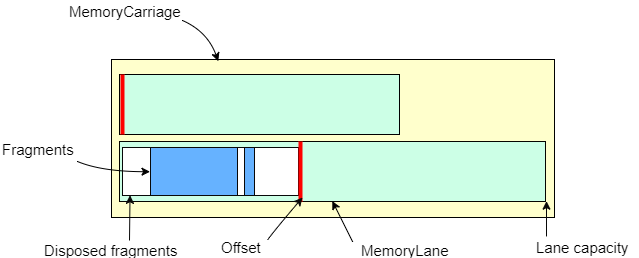
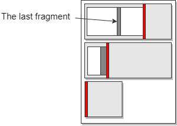

# Memory Lanes

> v1.3


## Description 

The MemoryLanes library provides a simple API for using preallocated memory buffers, 
which could be stored on one of three locations:

* The managed heap
* The native heap
* A memory mapped file

A **MemoryLane** represents a buffer which is already allocated and can be sliced
on demand by reserving ranges in one direction only.
Consequently there is no search involved and the exact number of bytes is blocked, as long as 
the lane has enough free space. 


A **MemoryFragment** is a GC heap object created by the MemoryLane allocation function.
It holds the starting offset and the length of the buffer slice as well as a
special destructor, injected by the Lane, which is triggered when the fragment is 
disposed. There is a common API for reading from and writing to the underlying
memory for all fragment types as well as a Span accessor.

```csharp
public abstract class MemoryFragment : IDisposable
{
	public abstract int Write(byte[] data, int offset, int length);
	public abstract int Read(byte[] destination, int offset, int destOffset = 0);
	public abstract Span<byte> Span();
	public abstract int Length { get; }
	public abstract void Dispose();
	public abstract StorageType Type { get; } 
	public byte this[int index]...
	public Span<T> ToSpan<T>()...
	public FragmentStream ToStream()...
	public MemoryLane Lane { get; }..
	...
	// Primitive reads and writes 
}
```

Similar to the thread stack deallocation, the MemoryLane cleanup is just an
offset reset, however that could only happen when there are no active fragments,
which means that the lifetime of the last fragment determines the reset time of the lane.
  




Due to the unpredictable fragment disposal time, using the lanes directly is not ideal.
A **MemoryCarriage** is a multi-lane allocator which is responsible for:

* allocating the requested slice on any lane, iterated in order 
* creating new lanes when there is no space in any of the current lanes


Depending on the actual memory storage location
one could use one of the following MemoryCarriage implementations:

* A **HeapHighway** - allocates memory on the managed heap, specifically on the Large Object Heap
if the initial capacities are greater that 80K, which is true by default (2 lanes - 8MB and 4MB)
* A **MarshalHighway** - allocates a buffer on the native heap using the Marshal.AllocHGlobal()
* A **MappedHighway** - uses a memory mapped file as a storage   

or cast them to the **IMemoryHighway** interface:

```csharp
public interface IMemoryHighway : IDisposable
{
	MemoryFragment AllocFragment(int size, int awaitMS = -1);
	int GetTotalActiveFragments();
	int GetTotalCapacity();
	int GetTotalFreeSpace();
	int GetLanesCount();
	int GetLastLaneIndex();
	void FreeGhosts();
	long LastAllocTickAnyLane { get; }
	bool IsDisposed { get; }
	StorageType Type { get; }
	IReadOnlyList<MemoryLane> GetLanes();
	MemoryLane this[int index] { get; }
}
```


### Reliable disposal


There are two disposal modes, which could be set in the HighwaySettings constructor:

- **FragmentDispose (default)** In this mode the consumer *must* dispose all fragments in order 
	to reset the lane. The only other option to unfreeze a lane is to *Force()* reset it, which is unsafe.

- **TrackGhosts** In order to dispose the correct number of lost fragments, each lane tracks them with 
   weak references and resets one allocation for every GC-ed and non disposed fragment. Even in this mode,
   one should still dispose for as long as there is one ghost fragment the lane reset is dependent on a GC pass.
   If the consumer disposes all fragments properly, this mode behaves as the FragmentDispose mode with the
   additional tracking overhead.

> The overhead is a longer allocation path including the creation of weak ref structures as well as the usage 
> of heavier kernel synchronization. The FragmentDispose mode spins. 

   The *TrackGhosts* mode shifts the responsibility from Disposing to launching the cleanup function with a 
   timer or in any other way. The MemoryCarriage as well the MemoryLane classes have a *FreeGhosts()* method
   which is multi-call protected, so it's safe to call it more than once.

   In general, forgetting to call Dispose on a fragment should be considered a bug. However if the consumers of the
   fragments are unknown the only safe assumption one could make is to expect a bad disposal.


## Usage scenarios

The original purpose for the lanes is message assembling in socket communication, which
demands quick memory allocation and release. In most cases the received bytes are 
immediately converted into a managed heap object and then discarded. With proper framing
one could make use of the different storage locations by using a heap highway for small messages
and a mapped highway when working with megabytes of data. 

### Consistent fragment lifetime

In cases when the lifetime of the fragments is short a two lane highway works fine. 
The second lane is needed for very high loads of concurrent allocations which prevents resetting by
always appending new fragments. When the first lane is full the MemoryCarriage will
shift the allocations to the next one, allowing the first to reset.

### Unpredictable fragment lifetime 

In network communication there is no delivery guarantee so the two lanes initial layout would be too optimistic.
Sometimes even small messages can be delivered in snail pace due to connectivity problems. In such cases 
having a dedicated highway per client is one option to reduce the probability of having a pinned lane. 
Alternatively, one may use a highway with multiple short lanes, expecting long living fragments and infrequent resets.
That way the amount of locked bytes is constrained to a value that seems reasonable in the specific case.



Example: Two 8M lanes could be structured as 16x1M lanes or 4x512K + 4x1M + 3x2M + 1x4M etc.

Additionally to the lanes API one could use the native heap directly through the 
**MarshalSlot** class. It is a MemoryFragment thus having the same Read/Write/Span
accessors, but it is not part of any lane and doesn't affect other fragments. 


## Highway limits

Using the MemoryCarriage is somewhat similar to a stack allocation, although the space isn't fixed,
unless one configures it to be so by passing an instance of the **HighwaySettings** class in the
Highway constructor.

```csharp
public class HighwaySettings
{
	public Func<bool> OnMaxLaneReached;
	public Func<bool> OnMaxTotalBytesReached;

	public const int MAX_LANE_COUNT = 1000;
	public const int MIN_LANE_CAPACITY = 1;
	public const int MAX_LANE_CAPACITY = 2_000_000_000;
	public const long MAX_HIGHWAY_CAPACITY = 200_000_000_000;

	public readonly int DefaultCapacity;
	public readonly int MaxLanesCount;
	public readonly long MaxTotalAllocatedBytes;
}
```

The OnMaxLaneReached and OnMaxTotalBytesReached control whether the Highway will throw a 
MemoryLaneExcepton with codes *MaxLanesCountReached* or *MaxTotalAllocBytesReached*. 
When any of these thresholds is reached (MaxLanesCount or MaxTotalAllocatedBytes) by
default the corresponding error code is thrown. If the delegates are not null and return true
the allocation will simply fail, returning null instead of a fragment instance.


### Size limits

One may notice that the buffer lengths are limited to Int32.MaxValue everywhere 
in the API, so one couldn't use a MappedHighway with 4GB mapped file.
The reason is having compatibility with the *Memory* and *Span* structs.


## Types

> The library doesn't use own namespaces.


In **System**:

- HighwaySettings

- **Fragments**
  - MemoryFragment (abstract)
  - HeapFragment
  - MappedFragment
  - MarshalFragment
  - MarshalSlot

- **Lanes**
  - MemoryLane (abstract)
  - HeapLane
  - MappedLane
  - MarshalLane
 
- **Highways**
  - MemoryCarriage (abstract)
  - IMemoryHighway (interface)
  - HeapHighway
  - MappedHighway
  - MarhsalHighway

- **Exceptions**
  - MemoryLaneException
  - InvariantException
  - SynchronizationException

In **System.IO**: 

- FragmentStream
- HighwayStream
- StreamExt

In **System.Collections.Concurrent**:

- CCube

