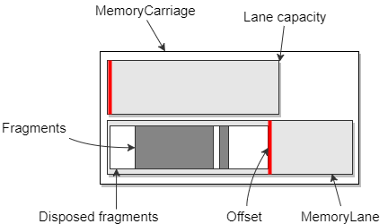

# Memory Lanes

> v1.0

## Description 

The MemoryLanes library provides a simple API for using preallocated memory buffers, 
which could be stored on one of three locations:

* The managed heap
* The native heap
* A memory mapped file

A **MemoryLane** represents a buffer which is already allocated and can be sliced
on demand in a thread stack manner, i.e. reserving ranges in one direction only.
Consequently the slicing is instantaneous (just a few atomic operations) because there 
is no search involved and additionally there is no memory fragmentation as the exact
number of bytes is blocked as long as the lane has enough free space. 


A **MemoryFragment** is an object created by the MemoryLane allocation function. It
holds the starting offset and the length of the buffer slice as well as a
special destructor, injected by the Lane, which is triggered when the fragment is 
disposed. There is a common API for reading from and writing to the underlying
memory for all fragment types as well as a Span accessor.

```csharp
public abstract class MemoryFragment : IDisposable
{
	public abstract int Write(byte[] data, int offset, int length);
	public abstract int Read(byte[] destination, int offset, int destOffset = 0);
	public abstract Span<byte> Span();
	public abstract int Length { get; }
	public abstract void Dispose();
}
```

Similar to the thread stack deallocation, the MemoryLane cleanup is just an
offset reset, however that could only happen when there are
no active fragments, i.e. the MemoryLane's active Fragments counter must be zero, 
which means that the lifetime of the oldest fragment determines the reset time of the lane.
  




Due to the unpredictable fragment disposal time, using the lanes directly is not ideal.
A **MemoryCarriage** is a multi-lane allocator which is responsible for:

* allocating the requested slice on any lane, starting from the oldest to the newest 
* creating new lanes when there is no space in any of the current lanes


Depending on the actual memory storage location
one could use one of the following MemoryCarriage implementations:

* A **HeapHighway** - allocates memory on the managed heap, specifically on the Large Object Heap
if the initial capacities are greater that 80K, which is true by default (2 lanes - 8MB and 4MB)
* A **MarshalHighway** - allocates a buffer on the native heap using the Marshal.AllocHGlobal()
* A **MappedHighway** - uses a memory mapped file as a storage   

or cast them to an **IMemoryHighway** interface:

```csharp
public interface IMemoryHighway : IDisposable
{
	MemoryFragment AllocFragment(int size, int awaitMS = -1);
	int GetTotalActiveFragments();
	int GetTotalCapacity();
	int GetLanesCount();
	long LastAllocTickAnyLane { get; }
	IReadOnlyList<MemoryLane> GetLanes();
	MemoryLane this[int index] { get; }
}
```

### Reliable disposal

> Applies to v1.0 

The current version does not implement reliable automatic fragment disposal. The reason is that 
it would involve more centralized storage and tracking, leading to more contention. One could easily
add such functionality by inheriting the corresponding Fragment with the desired destructor logic.
With the current API one could track ghost fragments by using the following metrics:

- **LastAllocTickAnyLane** in *MemoryCarriage* or casted as *IHighway*, this is the last allocation on any lane
- **LastAllocTick**, **Allocations** and **Offset** in the MemoryLane abstract class
- the **OnMaxLaneReached** and **OnMaxTotalBytesReached** callbacks as an alerting mechanism

For example if the LastAllocTick on a given lane is *dt* ms behind LastAllocTickAnyLane, the 
Offset indicates that there is not enough space and the Allocations remain the same in multiple checks,
one may decide to force reset the lane if the *dt* is considered enough for the particular scenario.

<br>

## Usage scenarios

The original purpose for the lanes is message assembling in socket communication, which
involves fast allocation and deallocation of memory. In most cases the received bytes are 
immediately converted into a managed heap object and then discarded. With proper framing
one could make use of the different storage locations by redirecting to a heap highway 
for small messages and to a mapped highway when working with tens or hundreds of megabytes of data. 

### Consistent fragment lifetime

In cases when the lifetime of the fragments is predictable a two lane highway works fine. 
The second lane is needed when there is a very high load of concurrent allocations preventing reset by
always having at least one active fragment. When the first lane is full the MemoryCarriage will
shift the allocations to the next one, providing a small time interval of no allocations for
the first lane allowing it to reset.

### Unpredictable fragment lifetime 

In network communication there is no delivery guarantee so the two lanes initial layout would be too optimistic
regarding the fragment disposal behavior. Sometimes even small messages can be delivered 
in snail pace due to connectivity problems. In such cases having a dedicated highway per client 
is one option for reducing the probability of having a pinned lane. Another possible solution is using a highway with multiple 
short lanes, expecting long living fragments and infrequent resets, that way the amount of locked
bytes is constrained to whatever value that seems optimal.


Example: Two 8M lanes could be structured as 8 2M lanes, assuming that one can
redirect larger than 2M messages to another highway, otherwise the MemoryCarriage will 
continuously append new lanes with the Min(default size, requested size), ignoring all
2M lanes. 

Alternatively to the lanes API one could use the native heap directly through the 
**MarshalSlot** class. It is a MemoryFragment thus having the same Read/Write/Span
accessors, but it is not part of any lane and doesn't affect other fragments. 


## Highway limits

Using the MemoryCarriage is somewhat similar to stack allocation, although the space isn't limited,
unless you configure it to be so by passing an instance of the **MemoryLaneSettings** class in the
Highway constructor.

```csharp
public class MemoryLaneSettings
{
	public Func<bool> OnMaxLaneReached;
	public Func<bool> OnMaxTotalBytesReached;

	public const int MAX_COUNT = 5000;
	public const int MIN_CAPACITY = 1023;
	public const int MAX_CAPACITY = 2_000_000_000;

	public readonly int DefaultCapacity;
	public readonly int MaxLanesCount;
	public readonly long MaxTotalAllocatedBytes;
}
```

One may notice that the buffer lengths are limited to Int32.MaxValue everywhere 
in this API, so one couldn't use a MappedHighway with 4GB memory mapped file.
The reason is having a consistency with the Memory<T> and Span<T> implementations.


## Summary

Use the MemoryLanes API to relieve the GC from managing workloads that are predictable 
or simple enough to be handled manually. 
