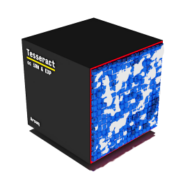



# Tesseract

The MemoryLanes use a concurrent data structure for tracking fragments. 
It's a virtual array allowing **safe multi-threaded, indexed access** to its cells 
**while expanding**. The actual storage are four jagged arrays with a side of 256 slots
and total capacity of 2^31. The generic Tesseract is constrained to reference types only
for the atomic ops to work, but there is an integer based version which is the same code
with minor differences.
 

## Accessors

The main accessors are:

| Method           | Description                                                     |
| ---------------- | --------------------------------------------------------------- |
| *Append*         | Adds an item and moves the AppendIndex, allocates if needed     |
| *Take*           | Replaces the cell value with a null and returns the original    |
| *RemoveLast*     | Like Append but decrements the AppendIndex                      |
| *get*            | Can read values up to the AllocatedSlots index                  |
| *set*            | Can set a cell if its index is less than AppendIndex            |
| *AppendIndex*    | The current position                                            |
| *AllocatedSlots* | The number of readable cells                                    |
| *ItemsCount*     | If CountNotNulls is true returns the total not-null cells count |
| *Clutch*         | Changes the TesseractGear (the Drive mode)                      |
| *Resize*         | Shrinks or expands explicitly                                   |
| *Format*         | Replaces all cells with an argument                             |
| *IndexOf*        | Searches for an object                                          |
| *Remove*         | Removes the cell at the IndexOf result                          |
| *NotNullItems*   | Enumerates the array and yields the cell if it's not null       |

## Drive

The cube supports different sets of concurrent operations at a time which can be observed as
the *Drive* property.

| TesseractGear | Allowed operations                                 |
| ------------- | -------------------------------------------------- |
| *N*           | get, set, Take, Format, NotNullItems               |
| *Straight*    | get, set, Take, NotNullItems, Append (the default) |
| *Reverse*     | get, set, Take, NotNullItems, RemoveLast           |
| *P*           | Resize only                                        |

The Drive can be changed by the *Clutch* method which is synchronized and will
block until all ongoing operations complete. 

## Internals

The ability to expand without copying data is in the predefined structure of the cube. 
There is an overhead of one reference (16 bytes) for each SIDE (4096 bytes), 
however the benefit of having a page size block is the ability to be defragmented by the GC.

The SIDE is not a byte length by chance. For quicker division and modular arithmetic it should be
a power of two, so that right shift and bitwise AND can be used. That said, one can do better.
The Tesseract indexing does not compute anything, it just interprets the four bytes of the
integer index as the direct 4D coordinates. Nothing beats that. 

### Locking

*Append* locks when expanding, otherwise it's just a few atomics. During allocation 
*Take*, *get*, *set* and the enumerator can safely traverse the array up to the *AppendIndex* position. 
The *Clutch*, *Resize* and *Format* lock, but they are semantically not concurrent. 
Everything else is lock free.

One may speed up the cube a bit by stopping the not-nulls counting in the ctor.
This feature (enabled with the default ctor) observes each cell modification and 
increments the total number of references if not null. At any point one may read 
the total objects count via the *ItemsCount* property. 

> The atomics cost increases with contention. One can verify this by benchmarking a
> preallocated Tesseract (will never lock) with an *empty* one. The lock acquiring plus
> the array allocation are nothing compared to the cache thrashing penalty.

### Expansion

One could design a custom growth by providing a *TesseractExpansion* callback in the constructor.
Whenever more slots are needed it will be called and the returned new size will be allocated.
The default behavior however (no callback) is much simpler - a 32xSIDE blocks are added at
each allocation, i.e. 8192 slots.

> The default expansion count may seem too much, compared to a classic length doubling, 
> however it's actually more conservative after 10K when the 2x growth overcommits and locks
> huge memory blocks.

The cube is very GC friendly, all blocks are 4K bytes in size and will be compacted.
Also partial or full deallocation will be noticeable, unlike LOH releases which the GC avoids collecting.

### Exceptions

If Append throws *OutOfMemoryException* exception or the user expansion callback throws, 
the *Drive* will be stuck in *Straight* position. Any ongoing *Clutch* calls will timeout 
(if set) or wait indefinitely. Except that all *Straight* methods will continue to work normally.

> Avoid try catch-ing in the TesseractExpansion callback as it is unnecessarily expensive
> in the context of a simple calculation such as AllocatedSlots * X.

One should expect *InvalidOperationException* in all accessors. This will be thrown
if the current Drive does not allow the operation. This exception has no effect on 
the cube state, i.e. it's normal and expected.

